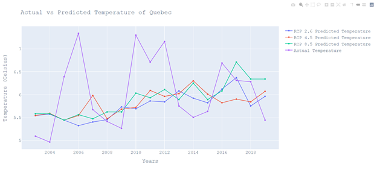
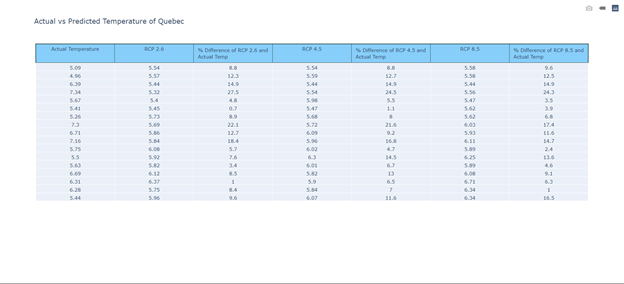
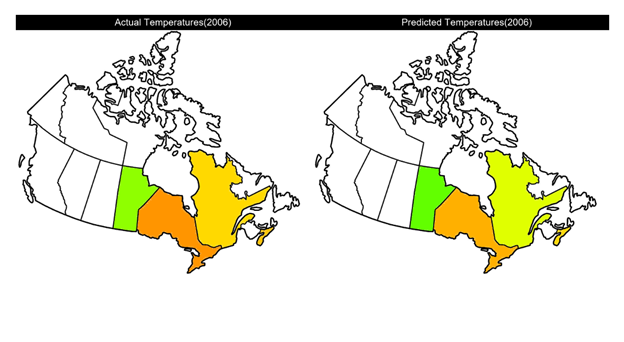

# Climate-Change-Simulation

## Problem Description ##

The natural atmospheric greenhouse effect is what makes life on earth possible. However, due to human activities - mainly the burning of fossil fuels - global emission of greenhouse gases (such as carbon dioxide, methane, etc.) has increased significantly over the past few years, and as more of these gases become trapped in the Earth’s atmosphere, the average temperature of the world rises. This is because greenhouse gases are transparent to visible light but opaque to infrared radiation, so sunlight can travel through them but heat is blocked. Climate scientists observe this effect (among others) by collecting data (such as temperature, precipitation, etc.) and construct models to predict future temperatures for various Representative Concentration Pathways (abbreviated as RCPs). RCPs make predictions of the concentration of greenhouse gases in the atmosphere by capturing the effect of human activities and future trends on greenhouse gas emissions. The four RCPs range from very high (RCP 8.5) through to very low (RCP 2.6) future concentrations.

One such climate model is the BCCAQv2. This was developed by the Pacific Climate Impacts Consortium and aims to rectify the bias in daily precipitation series that is found in other popular climate models. This creates data that more accurately matches historical records. Essentially, this preserves the precipitation change signal while downscaling daily climate predictions relating to temperature and precipitation. This model is a mathematical equation attempting to estimate the climate trend through interactions within the atmosphere. In order to develop well-structured and long-term plans to deal with climate change, it is crucial that these estimates be as accurate as possible. For this reason, we have decided to test the accuracy of this model by comparing actual values of temperature recorded in Toronto against those predicted by the BCCAQv2 climate model, for various RCPs

## Research Question ##

**How do real temperature values compare to those predicted by the BCCAQv2 climate model?**

## Explanation of Results ##

To draw the two coloured maps (one that represents the real temperatures and one that represents the predicted
temperatures for various RCPs for all the provinces ), the user is prompted to input the year and the predicted RCP
value for which they would like to see the maps for. Additionally, to plot the scatter-line graph (which displays the
temperature values for various RCPs and the actual temperature for a given time period) and draw the table showing
the values from the graph for a city of their choice, the user is asked to input a city name. Each input has its own
prompt to explain to the user exactly what is required of them.
3Once the user has input all three of these, the run() method is called. The data pertaining to the various cities
available for the user to select (i.e. the file names which contain real/predicted, the coordinates of the city on the
map, and the name of the city) is stored as constants. The data for each city is processed using the helper functions
defined in the computing data.py file within a for loop. If the name of the city the user inputted is the same as the
one being iterated in the for loop, a scatter-line graph (showing the various RCPs temperatures using unique colors
plotted against their corresponding year) and a table showing the data values of the graph for that city are displayed.
The user can hover over each scatter plot to see the exact temperature value for the various years and they can even
hide/show any of the plotted lines in the graph.
The data necessary for the year inputted by the user is stored in the CITY TEMPS dictionary, where the city name
is mapped to a list containing actual, RCP 2.6, RCP 4.5, and RCP 8.5 temperature values respectively for that year.
Next, the draw map() function uses this dictionary to create the map: it first takes an empty map of the provinces of
Canada and colors the provinces according to their capital city’s actual temperatures, and then creates another map
(map2) and colors the provinces according to their capital city’s predicted temperatures at the RCP value the user
inputted. Finally it merges these two maps side by side and adds their relevant titles.
Eventually, 1 scatter-line graph and 1 table is created for the city the user input, and a map of Canada is created for
the RCP value and year typed in. The user can continue creating these visuals as much as they want - this is made
possible with a while loop. In order to break out of this while loop, the user should type in 2 wrong values/names for
the given prompt.

## Instructions ##

* Install all the libraries listed under requirements.txt
* Run main.py
* You will be prompted to answer 3 questions one-by-one before the final output is displayed.
    * First, enter the year for which you would like to see the colored maps comparing real vs predicted temperature values (e.g. your input is 2003).
    * Second, enter the name of the city for which you would like to see a scatter-line graph and table representing the various RCP temperature predictions compared to the real temperatures values (e.g. your input is toronto).
    * Third, enter an RCP value for the comparison being made in the colored map of all the provinces of Canada (e.g.your input is RCP 4.5).
* You should have 3 figures pop up: the scatter-line graph and table for the city you entered and also a colored map of the provinces of Canada.
    * The scatter-line graph plots years on the x-axis and on the y-axis has multiple plotted plots corresponding to the various RCPs and also the actual temperature value.
    * The table depicts the data from the graph but also shows the percentage differences between the RCP predicted temperature and the real temperature for all the years.
    * The colored map shows a comparison of real temperature values and the predicted temperature values of the RCP you input in the form of color differences.
* This process can be repeated as many times as you want (for all the different years/citines) until you provide 2 incorrect inputs to a question. 
* * You can interact with the scatter-line graph by hovering over the plotted points to see their individual precise values but you can select the option to ‘Compare data on hover’ to compare all plotted lines together. You can also hide/unhide lines of the graph by clicking on the key on the right.
* 
We have provided example screenshots of how the figures might look once the code is executed below

